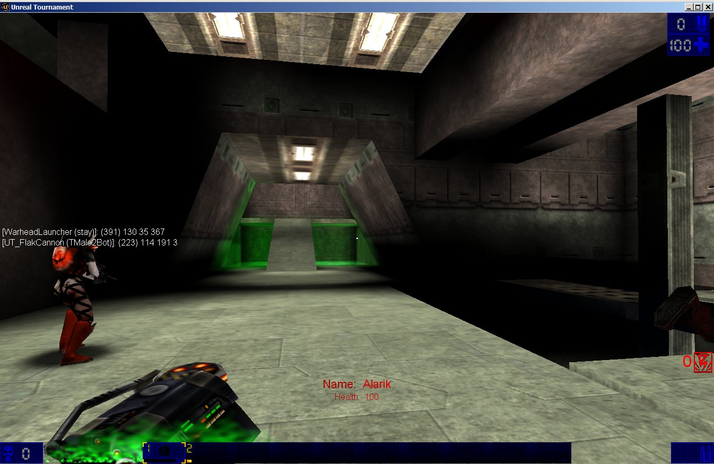
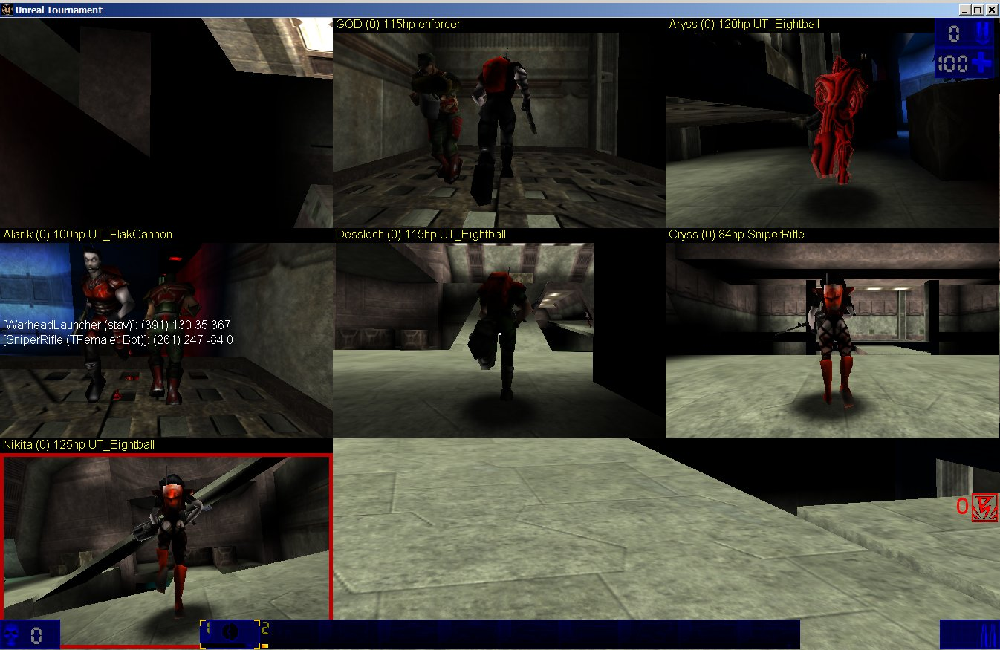

# CoopTranslocator
CoopTranslocator for Monster Hunt for UT99.

Allow you choose teammate and teleport to him.

You can preview all of your teammate before teleport.

Each player get CoopTranslocator at start.

If other CoopTranslocator found in Inventory then it is destroyed.

Difference from original:
1. You can preview players.
2. Green texture near teleporter for distinguish from usual teleporter.
3. Fixed a lot of bugs.
4. If player moves up in lift you can not tele. (For prevent kill him)
5. If string(PRI.bCoopTeleDisable) == "True" you can not tele. (For extends by some server via function "disable/enable tele to me")
6. If you can not tele - description provided.
7. Clean up code.
8. Set rotation to target.
9. Place to tele is up and little back target.
10. Press Fire + Alt fire for return back to prev weapon.
11. And a lot other small improvements.
